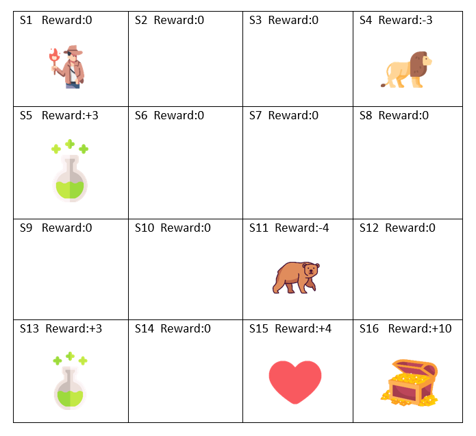

# ForestHunt: A Grid-World Problem.

## Forest Hunt is set in a forest environment where the main character/ hero embarks on a journey through the green depths of the unknown to find the Hidden Treasure. Where the hero might encounter ferocious beasts and wild animals or healing portions in order to complete the quest and find the treasure.

### __Theme__: Adventure Grid World with health as positive rewards and wild animals as negative rewards.
### __States__: {S1 = (0,0), S2 = (0,1), S3 = (0,2), S4 = (0,3), S5 = (1,0), S6 = (1,1), S7 = (1,2), S8 = (1,3), S9 = (2,0), S10 = (2,1), S11 = (2,2), S12 = (2,3), S13 = (3,0), S14 = (3,1), S15 = (3,2), S16 = (3,3)}
### __Actions__: {Up, Down, Right, Left}
### __Rewards__: {-3, -4, +3, +4, +10}
### __Objective__: Reach the treasure with maximum reward. The hero must avoid wild animals to prevent health loss and strategically collect health boosts and restoration potions to maintain a high health level during the journey.

### In order to optimize the performance of our Hero; SARSA, and Q-Learning with multiple settings were used to find the optimal parameters.

### This is the grid world we've worked on.

